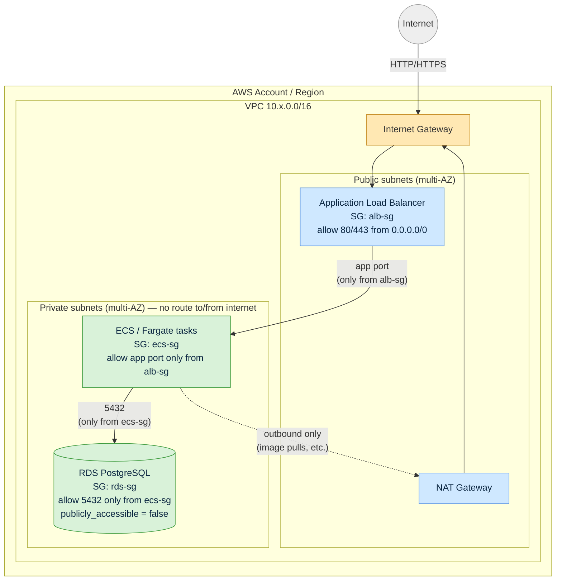

# Hotel Booking Platform — DevOps Assessment

Terraform infrastructure design (AWS: ALB → ECS/Fargate → RDS) plus a local,
runnable PostgreSQL setup demonstrating schema design, seed data, query
optimization, and backup/restore.

Actual AWS deployment is **not** required or performed. Terraform is
validated with `fmt` / `init` / `validate` / `plan` only (see [Part 1: Terraform](#part-1-terraform-infrastructure)).

## Secure architecture diagram



**Security boundaries enforced by the Terraform in this repo:**

- **Internet → ALB only.** The ALB security group (`alb-sg`) is the only
  thing reachable from `0.0.0.0/0`, and only on the app port (80/HTTP by
  default).
- **ALB → ECS only.** The ECS task security group (`ecs-sg`) accepts
  inbound traffic only from `alb-sg` — nothing else in the VPC, and nothing
  from the internet, can reach the application tasks directly.
- **ECS → RDS only.** The RDS security group (`rds-sg`) accepts inbound
  traffic (port 5432) only from `ecs-sg`. RDS also sets
  `publicly_accessible = false` and lives entirely in private subnets, so
  it has no route to/from the internet regardless of security group rules.
- **No public IPs on compute or data.** ECS tasks (`assign_public_ip =
  false`) and RDS both live in private subnets; only the ALB (and the NAT
  Gateway, for egress) sit in public subnets.
- **Encryption at rest.** RDS storage is encrypted (`storage_encrypted =
  true`).

## Repository layout

```
infra/
  modules/
    network/   # VPC, public/private subnets, IGW, NAT
    ecs/       # ALB, ECS cluster/task/service, ALB + ECS security groups
    rds/       # RDS instance, RDS security group, subnet group
  envs/
    dev/       # small sizing, short retention, deletion protection off
    prod/      # larger sizing, long retention, deletion protection on
db/
  migrations/  # schema + indexes, run in order on container init
  seed/        # seed data, run after migrations on container init
scripts/
  backup.sh    # timestamped pg_dump
  restore.sh   # restore into a fresh database
docker-compose.yml
.github/workflows/terraform.yml
```

## Part 1: Terraform infrastructure

Traffic flow: **Internet → ALB (public subnets) → ECS/Fargate (private
subnets) → RDS (private subnets)**.

- `modules/network`: VPC with 2+ public subnets (ALB) and 2+ private subnets
  (ECS + RDS), an Internet Gateway for public subnets, and a NAT Gateway so
  ECS tasks in private subnets can still pull images / reach the internet.
- `modules/ecs`: ALB + target group + listener, ECS cluster, Fargate task
  definition (placeholder `nginx` image, swappable via `container_image`),
  and the Fargate service. Two security groups:
  - **ALB SG**: allows inbound `80` from `0.0.0.0/0`.
  - **ECS task SG**: allows inbound only from the ALB SG.
- `modules/rds`: RDS PostgreSQL instance in private subnets, `publicly_accessible = false`,
  and an **RDS SG** that only allows inbound from the ECS task SG — RDS is
  not reachable from the internet or from anywhere except the application
  tasks.

### Validating locally (no AWS account needed)

Each environment uses a **local** Terraform backend and a provider
configured with `skip_credentials_validation` / mock credentials, so
`init`/`validate`/`plan` run fully offline (see `infra/envs/*/versions.tf`).
`backend.hcl.example` in each env shows the real S3+DynamoDB backend you'd
switch to for an actual deployment.

```bash
cd infra/envs/dev      # or infra/envs/prod
terraform fmt -check -recursive -diff ../../..
terraform init -input=false
terraform validate
terraform plan -var-file=dev.tfvars -refresh=false -input=false
```

Both `dev` and `prod` have been verified to `fmt`/`init`/`validate`/`plan`
cleanly (dev: 31 resources to add, prod: 35 — prod adds an extra AZ).

## Part 2: Environment handling

```
infra/
  modules/{network,ecs,rds}
  envs/
    dev/{main.tf, variables.tf, versions.tf, dev.tfvars, backend.hcl.example}
    prod/{main.tf, variables.tf, versions.tf, prod.tfvars, backend.hcl.example}
```

Each environment has its own `variables.tf`, `.tfvars`, backend config
example, and state file (`terraform.<env>.tfstate`, local-backend only —
real deployments would point at separate S3 buckets, see
`backend.hcl.example`).

| Setting                   | dev                 | prod                          |
|----------------------------|--------------------|--------------------------------|
| AZs / subnets              | 2                  | 3                              |
| RDS instance class         | `db.t3.micro`      | `db.r6g.large`                 |
| RDS storage                | 20 GB              | 100 GB                         |
| RDS backup retention       | 1 day              | 30 days                        |
| RDS deletion protection    | `false`            | `true`                         |
| RDS Multi-AZ               | `false`            | `true`                         |
| RDS skip final snapshot    | `true`             | `false`                        |
| ECS task size (cpu/memory) | 256 / 512          | 1024 / 2048                    |
| ECS desired count          | 1                  | 3                              |

## Part 3: Terraform plan in GitHub Actions

`.github/workflows/terraform.yml` runs on every PR touching `infra/**`, for
both `dev` and `prod` (matrix build):

1. `terraform fmt -check -recursive`
2. `terraform init`
3. `terraform validate`
4. `terraform plan -refresh=false` — output is (a) uploaded as a workflow
   artifact (`terraform-plan-<env>`) and (b) posted as a PR comment.

No AWS credentials are configured in CI — the local backend + mock provider
credentials in `versions.tf` make this work without a real AWS account,
consistent with the "plan-only" nature of this assessment.

## Part 4-5: Local database, seed data, and indexing

Uses **PostgreSQL 16** via Docker Compose. Schema (`db/migrations/001_create_tables.sql`):
`hotel_bookings` and `booking_events` (with `booking_events.booking_id` as
FK to `hotel_bookings.id`), matching the schema given in the assessment.

### Run it

```bash
docker compose up -d
# If port 5432 is already taken locally: DB_HOST_PORT=5433 docker compose up -d

# Wait for health check, then verify:
docker compose ps
docker exec hotel-db psql -U hotel_app -d hotel_bookings -c "SELECT COUNT(*) FROM hotel_bookings;"
docker exec hotel-db psql -U hotel_app -d hotel_bookings -c "SELECT COUNT(*) FROM booking_events;"
```

Migrations/seed files are mounted into `/docker-entrypoint-initdb.d/` and
run automatically, in order, **only the first time** the data volume is
created:

1. `001_create_tables.sql` — schema
2. `002_indexes.sql` — indexes (see below)
3. `010_seed.sql` — seed data: 6,600 bookings across 5 cities
   (delhi/mumbai/bangalore/pune/goa), 5 orgs, and 5 statuses
   (confirmed/cancelled/pending/completed/refunded), spread over the last
   180 days, plus a guaranteed batch of recent "delhi" bookings so the
   target query below returns real data; ~9,800 `booking_events` rows for
   about half of all bookings.

To re-seed from scratch: `docker compose down -v && docker compose up -d`.

### Query optimization

Target query:

```sql
SELECT org_id, status, COUNT(*), SUM(amount)
FROM hotel_bookings
WHERE city = 'delhi'
  AND created_at >= NOW() - INTERVAL '30 days'
GROUP BY org_id, status;
```

Index added (`db/migrations/002_indexes.sql`):

```sql
CREATE INDEX idx_hotel_bookings_city_created_at
    ON hotel_bookings (city, created_at)
    INCLUDE (org_id, status, amount);
```

**Why this index:**
- `city` leads the index because it's an equality filter; `created_at`
  comes second because it's a range filter — this ordering lets Postgres
  narrow to a small, contiguous index range instead of scanning everything
  matching only one predicate.
- `org_id`, `status`, and `amount` are added via `INCLUDE` (not as index key
  columns) so the index alone can answer the whole query — an **index-only
  scan** — without a heap fetch per matching row. They're not used for
  filtering/ordering, so including them (rather than making them key
  columns) keeps the index smaller and cheaper to maintain.

Verified with `EXPLAIN (ANALYZE, BUFFERS)` against the seeded data
(6,600 rows). Before `VACUUM`, Postgres uses a Bitmap Heap Scan (visibility
map not yet fully set on freshly inserted rows); after `VACUUM`, it's an
**Index Only Scan** with `Heap Fetches: 0`:

```bash
docker exec hotel-db psql -U hotel_app -d hotel_bookings -c "VACUUM ANALYZE hotel_bookings;"
docker exec hotel-db psql -U hotel_app -d hotel_bookings -c "
EXPLAIN (ANALYZE, BUFFERS)
SELECT org_id, status, COUNT(*), SUM(amount)
FROM hotel_bookings
WHERE city = 'delhi'
  AND created_at >= NOW() - INTERVAL '30 days'
GROUP BY org_id, status;"
```

```
 HashAggregate  (cost=56.75..57.06 rows=25 width=65) (actual time=0.559..0.567 rows=25 loops=1)
   Group Key: org_id, status
   ->  Index Only Scan using idx_hotel_bookings_city_created_at on hotel_bookings
         Index Cond: ((city = 'delhi'::text) AND (created_at >= (now() - '30 days'::interval)))
         Heap Fetches: 0
 Execution Time: 0.603 ms
```

A secondary index, `idx_booking_events_booking_id`, is added on
`booking_events(booking_id)` since it's an FK column with no implicit index
in Postgres, and any join/lookup of events by booking would otherwise
require a full table scan.

## Part 6: Backup and restore

```bash
./scripts/backup.sh          # writes backups/hotel_bookings_<timestamp>.dump
./scripts/restore.sh         # restores the most recent backup into a fresh
                              # "hotel_bookings_restore" database
./scripts/restore.sh path/to/specific_backup.dump   # or a specific file
```

- `backup.sh` runs `pg_dump -F c` (Postgres custom format — compressed,
  restorable with `pg_restore`) against the running `hotel-db` container.
- `restore.sh` drops/recreates a **separate** database
  (`hotel_bookings_restore`, overridable via `RESTORE_DB_NAME`) inside the
  same container and restores into it, so restore can be verified without
  touching or risking the original database.

### Verifying a restore worked

```bash
docker exec -it hotel-db psql -U hotel_app -d hotel_bookings_restore -c "SELECT COUNT(*) FROM hotel_bookings;"
docker exec -it hotel-db psql -U hotel_app -d hotel_bookings_restore -c "SELECT COUNT(*) FROM booking_events;"
docker exec -it hotel-db psql -U hotel_app -d hotel_bookings_restore -c "\d hotel_bookings"
```

Compare the row counts against the source database — they should match
exactly (verified locally: 6,600 / 9,840 in both). `\d hotel_bookings`
confirms the indexes and the `booking_events` foreign key came through
intact.

## End-to-end verification checklist

```bash
# Terraform (from infra/envs/dev or infra/envs/prod)
terraform fmt -check -recursive -diff ../../..
terraform init -input=false
terraform validate
terraform plan -var-file=dev.tfvars -refresh=false -input=false

# Database
docker compose up -d
./scripts/backup.sh
./scripts/restore.sh
```
